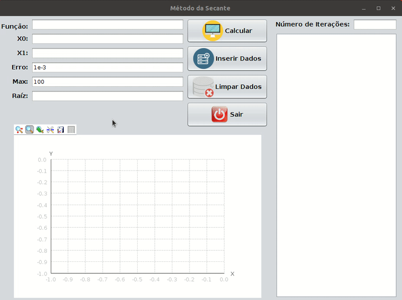

#Secant-Method-Calculator

UTFPR Numerical Calculus final project, created using the Java Swing graphical library for graphical interface, Jep library to analyze and evaluate mathematical expressions, and the JMathPlot library to display interactive graphs 2D Plotting.

